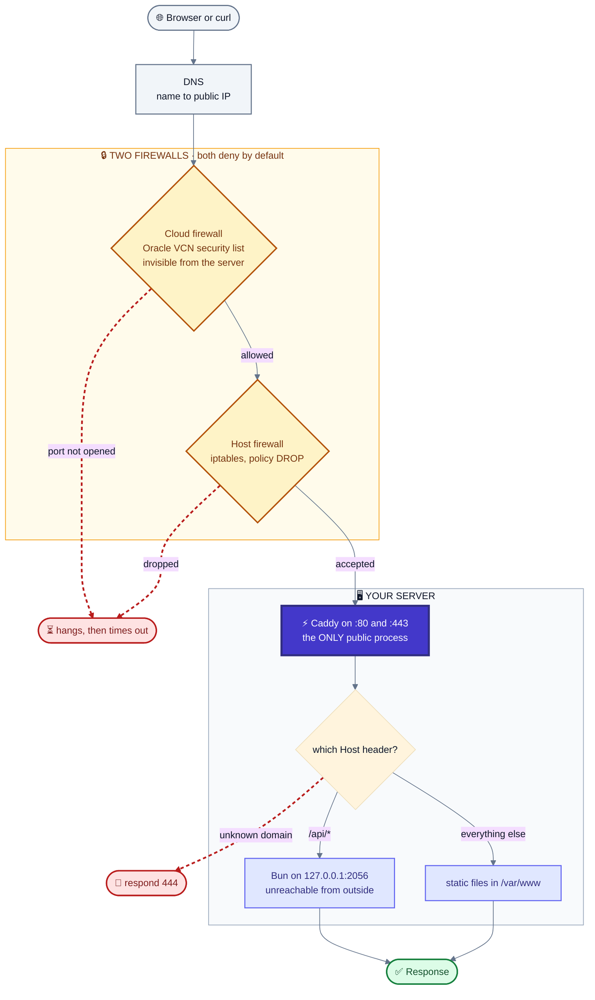

# vps from scratch

## WHAT THIS FILE IS

Long-form newsletter post. ~2,500 words of prose. Written for a Canva layout where the
code blocks are rendered as images.

FOR THE DESIGNER

- 9 code blocks, each marked `<!-- IMAGE n -->` with an italic caption line underneath.
  They are deliberately short so they read as graphics, not walls of text. Longest line
  is 75 characters, so nothing wraps at any sensible width. Use a single monospace font
  and one background colour across all 9 so they read as a set.

- IMAGE 8 (`namei -l`) is the hero. If one code image gets full width, make it that one.
- IMAGE 1 is two words. Set it big, centred, as the opening visual.
- One mermaid diagram, marked `<!-- DIAGRAM -->`. It is already themed and coloured, so
  render it as-is at <https://mermaid.live> and drop in the PNG/SVG. Full width, it is the
  spine of the piece. Caption underneath.
- 4 pull quotes marked `<!-- PULL QUOTE -->`. The first and last are the two worth
  setting big.
- Section headings are the only separators. There are no horizontal rules, on purpose.
- Links are inline markdown. Keep them live.
- Delete this comment block before publishing.

# Article

**Title:** Hosting a web service on a free vps

**Subtitle:** I put my site on a free server. Here is the mental model I was missing, and every error that taught it to me.

Open a terminal, any terminal, and run this:

<!-- IMAGE 1 -->
```bash
curl raghav56.tech
```

*Caption: try this before you keep reading.*

You get a business card. Coloured, boxed, laid out for a terminal. Open [the same URL](https://raghav56.tech) in a browser and you get an ordinary website instead.
Same address, same server, two completely different things, decided by one header.

That trick is the last 5% of this story. The other 95% was getting a free server,
discovering how exactly does a web request works, all layer
between your code and a stranger's requester (browser or terminal),
and every way that can go wrong.

I have done this multiple times now, on two machines, seven months apart.
The first time it took Weeks, there was sooo much that went wrong, and
the second time was still a whole night, you always learn so much.
I'll try to explain the difference between them is this newsletter, so you can do it in a few days.

A few things before we start:

I don't have nearly enough space to write about everything, I'll name drop a bunch and implicitly  leave many things to be done via:

- The loop of asking LLMS "how to deep guide with how and why and what else",
- It works yes, and these questions are must while following a guide,
- Also the how, why are important, otherwise believe me second time might still be in weeks

I'll focus on listing things that AI failed me with, it's perfectly valid to just give this blog to an AI and ask it to guide along if you want that, me personally prefer reading guides and asking my own questions in multiple chats with forks of forks of forks.

A bunch of things here are Probably approximately correct (PAC the short form a friend uses), because its based on my experience, though ofc these things worked so keep in mind things have caveats.  
I'll PAC try to mark the places in this which are particularly so, like this <- PAC

I got helped by a bunch of people throughout, seniors, peers. Unnamed because idk if they are okay to be named, also don't wanna miss anyone, but I am really grateful.

## The free machine is real, and it is not a toy

[Oracle Cloud's Always Free tier](https://www.oracle.com/cloud/free/) is not a trial and you get it forever.
The ARM allocation is **2 CPUs and 12 GB of RAM** (used to be double that,
you are already seriously missing out, don't delay).

Github student pack and other trials are temporary and give a fraction of resources of even the current free quota.

Here is an image of me ssh-ing into and resource stats of my machine:

<!-- IMAGE 2 -->


This machine hosts multiple web services, databases, backends of mine and my friends.

Yes you'll need a credit or debit card with international payments and  
1 SGD for normal account here.

Make your oracle account tenancy in some good region (mine is US Ashburn), Hyderabad is filled that was my first attempt. This will help in next step.

Make sure to set up 2FA and then passkey for the account, it helps a lot.

### The Instance and VCN

#### VCN

This step can technically be skipped, VCN can implicitly be created during the creation of Instance.

Go here for allotting an VCN (Virtual Cloud Network):


This is what connects your Instance to the Internet, connections to and from go through.

Also this is where you'll be managing the subnet, and the security list.

Here's the security list:


Use the Security rules in "Default Security List for [server name]"

This is the foundation you'll need for initial setup, later if you the `tailscale` thing properly, you def wont be dealing with this day-to-day.

#### Instance

Go here for allotting an instance


1. You will see **"Out of capacity for shape VM.Standard.A1.Flex"**, you'll have to probably try several times.

- Remember the tenancy from previous step.
- If it still doesn't work upgrade to a PAYG (Pay as you go) account.

It'll require holding 11-12k Rs for PAYG upgrade, it has been seriously worth it for me,  
ofc these will be refunded and as long as you're smart you'll never be charged.

2. **Your machine is ARM**. Download `arm64` builds, not `amd64`. An x86 binary gives you
`Exec format error` and no other hint.

For the configs ask some llm, just use the best free quota allows, storage, vcpu, etc whatever, its mostly personal preference thing, I used the max though I got 3 accounts so whatever.
For OS I used ubuntu minimal of the LTS version at that time.

You will here be, creating via the interface or providing your own, a rsa based ssh key pair. This is the only easy way to log in, so keep it safe.
More on this in the next section.
\* Not ed25519, rsa.

Note the Public IP of the instance, you'll need it for many things including to ssh into the server.


## Accessing it: SSH and firewalls

Two things that make things soo convenient if person I'm working with knows are git and ssh.

Be careful about whats to be done on your local machine and what the server.  
By default, for this section of guide, its mostly on your local machine, like things on server also but you'll know what, when you're doing then.

The private key of the pair in previous step is to be saved at: `~/.ssh/`.

The command to ssh into the server is:

```bash
ssh username@server_public_ip

# eg for me
ssh ubuntu@150.xx.xx.xx
# with tailscale
ssh ubuntu@oracle
# with ssh config
ssh oracler
```

It won't work as it is, you'll have to allow your machine to reach and access the server in 3 layers.

1. The first is cloud firewall, which is the security list in VCN from before, it has to allow port 22 for your machines public IP.
Ask an llm how to find it, mp curl something with `-v4` or some system command.

2. The second is the host (your instance) firewall, which is the iptables on the server.
Allow same IP:port as step 1, ask llm for commands.
Here guides and llms will push you towards `ufw`, but it is not installed by default on the oracle image, and setting it us is an hassle tbh <- PAC.

3. Authentication (Do read about Authentication vs Authorization sometime).
This was already done by creating and saving the key. - PAC -
You might have to start the daemon or add the key somehow, ask ai on error.

Remembering and understanding these is **very** helpful and satisfying.

### SSH config

Now lets make it easier, it is the ssh daemon which manage the above connection, they read a config file,  
`~/.ssh/config`, if not already made, create it.  
Now configure it, ask some llm what exactly.

Here's an scaffolding from my setup,

```text
Host oracler
    User ubuntu
    HostName [oracle/Public_IP]
    IdentityFile ~/.ssh/ssh-key-[exact path].key
    IdentitiesOnly yes
    AddKeysToAgent yes
    TCPKeepAlive yes
    ServerAliveInterval 60
    ServerAliveCountMax 10
```

Ask what each thing means to a llm.  
Hostname is interesting, its initially the public IP of the server, but later when we use tailscale, it will be the tailscale hostname, the one alloted by MagicDNS feature, remember to enable (if its not) during next step.

## Tailscale and VPN

Tailscale is a decentralised VPN that makes your server and your local machine part of the same private network, so you can access it without exposing them to the public internet <- PAC.

[set it up](https://tailscale.com/) on both your server and your local machine.
Basically download and login with same account and add as a service with systemd, follow the docs or ask ai.
Once set up, you can replace public IP from above step to the tailscale hostname in your ssh config, and ssh into your server without exposing it to the public internet(bypass the need for dealing with the layer 1 defence from above).

You might have to open the port 41641 in the cloud firewall and iptables for tailscale to work,
if things are not working ask ai how to check and do it.

Theres a lot one can do with tailscale, explore.

## The mental model I was missing

I wish I could give my past self this diagram.

<!-- DIAGRAM -->


↑ PAC

*Caption: three gatekeepers before your code ever runs. Any one can say no, and none of them will tell you. As you saw above*

\* This uses specific things name, for eg there could be systemd or nginx in place of caddy, though above is a good default

Notice where my applications actually are attached, bottom of the diagram, on `127.0.0.1` i.e. localhost, only processes on the machine can access them.  
Read about Host = IP:port, difference bw `0.0.0.0` and `localhost`

> Your app is not on the internet. Something in front of it is.

## It runs, you close the laptop, it stops

Your first task while deploying is making things work locally, on your own laptop or the SSH session.
Then comes persistence, when you close the session or wifi drops, the site dies with it, because your program was a child of your login session and the session ended.

The usual first fixes are `nohup` and `tmux`. Both survive logout. Neither restarts your app
when it crashes, survives a reboot, or leaves any trace the service exists.

The real answer is a system utility: [systemd](https://www.freedesktop.org/software/systemd/man/systemd.service.html).
It started every other service on your box and will happily start yours, spend some time getting familiar with this.
\* ofc there are abstractions over abstraction in our field, ik about  `runc`

Every other program you can use for this purpose is an abstraction over it, pm2, docker, etc.

Learn things like `systemctl status agent`, `journalctl -u agent`, `systemctl enable agent`, `systemctl restart agent`, etc.
They help a bunch in debugging and managing your service, while doing other tasks also.

My very first attempt, from that earlier server, for representational purposes, mine was better ofc:

<!-- IMAGE 3 -->
```ini
[Service]
User=ubuntu
WorkingDirectory=~/raghav/Agent_kdg
ExecStart=uv run main.py
StandardOutput=append:logs/server.log
```

*Caption: four separate mistakes in four lines. Can you spot them?*

PAC ↓ (keeps changing, diff envs, diff versions, etc etc, representational and helpful)

systemd told me, in language that is genuinely useful once you can read it:

<!-- IMAGE 4 -->
```text
Loaded: bad-setting
Main PID: 3476 (code=exited, status=203/EXEC)

WorkingDirectory= path is not absolute: ~/raghav/Agent_kdg
```

*Caption: three error strings worth memorising. You will meet all of them.*

**`path is not absolute: ~/...`** means systemd does not expand `~`. Tilde expansion is a
*shell* feature and there is no shell here. Same for `$HOME`, globs, and `&&`.

**`status=203/EXEC`** means systemd could not execute what you named. Wrong path, missing
file, or missing execute bit.

**`Loaded: bad-setting`** means the unit file is invalid, so nothing ever ran. That differs
from `Loaded: loaded` plus `Active: failed`, which means your program started and exited.
One is your config, the other is your code.

A quieter fourth: relative paths in `StandardOutput=append:logs/server.log` resolve against
`/`, not your working directory.

Then the one that catches everybody exactly once. Both commands succeed. Nothing runs:

<!-- IMAGE 5 -->
```bash
sudo systemctl start agent
pgrep -f "uv run main.py"
# nothing. no error. no output.
```

*Caption: because philosophy of posix is no message on succeed, silence is the worst error message.*

`ExecStart` said `uv`, and systemd has no idea where that is. **systemd does not read your
`.bashrc`.** Neither does cron, nor `ssh host "command"`, which is how your CI will deploy.
Every tool in your home directory is invisible to all three. Run `which uv`, paste the full
path.

## Nothing can reach it, caddy 1

Here we'll setup a reverse proxy, which acc to the analogy I used with my friend is like a portal master or gatekeeper+receptionist, we'll come back to this analogy in next section.

Before we install anything next is an important concept to understand.

**Layer one is what address your app bound to.** A socket binds to an address *and* a port.  
`127.0.0.1` or `localhost` means the kernel only delivers packets that came from this same machine. "It is blocked from the internet", only processes on the machine, which obv do not require internet to access it can do so.
`0.0.0.0` means every interface, public ones, which can somehow know its public ip included.
↑ PAC

Build the habit of reading the address column, never just the port:

<!-- IMAGE 6 -->
```bash
$ ss -tlnp
LISTEN  127.0.0.1:2056   bun     ← unreachable from outside
LISTEN          *:443    caddy   ← the only public door
```

*Caption: same machine, same kind of app, completely different exposure.*

Since most examples only show `port`, people make very suboptimal choices even when they have a reverse proxy.
It's such a waste to have a portal master when labeled portals exist and anyone can walk in (okay there are locks, but yk can be cracked).  
For eg in Bun, `Bun.serve({ port: PORT })` with no hostname binds `0.0.0.0`.  
Pass `Bun.serve({ port: PORT, hostname: "127.0.0.1" })` instead.  
Ask an AI how to use localhost for your stack in production, not just dev.

**Layer two is the host firewall.** Same `ufw` stuff from before, we don't have it on our machine, ignore that all.
Rules are raw iptables with a default DROP policy, saved with `netfilter-persistent`, ask ai how to do it.  

PAC ↓
And while you are in there: **never run `iptables -F` on Oracle Cloud.** The default rules carry cloud metadata, DHCP, NTP, and the iSCSI mount for your boot volume. Flushing them can cost you the root disk.
\*BTW I did run this lol following an AI guide, and it cost me more than 15 minutes of debugging, that too because i had the record of how my iptables look like in personal documentation.

**Layer three is the cloud firewall**, invisible from inside the machine.  
In Oracle's security list, mentioned before, only port 22,which is used for ssh is open and nothing else.  
Make sure to open 80 and 443 for your public IP, respectively for http and https.

\*BTW this firewall only comes into play when using the VCN provided by Oracle, if you're doing anything via tailscale stuff, its bypassed, dw about it.

PAC ↓
To identifies the layer with problem look at the *shape* of the failure, not the message:

- Hangs, then times out → a firewall dropped it silently. Layer two or three.
- Instant `connection refused` → it reached your machine, nothing was listening. Layer one.
- Connects, then nothing → your app is broken.

Now install the proxy you want to nginx, caddy, apache, whatever this part is hard to get wrong so set it up also.

Also Before you have a proxy, `0.0.0.0` is the *correct* answer and
`127.0.0.1` will drive you mad, because nothing outside can reach it, including you.  
Once a proxy exists, everything moves back to loopback, thats because its that proxy running at `0.0.0.0` and it is the one that is reachable from outside, something has to be yk.

## The Portal master, caddy 2

Or as AI asked me to call it the reception.

Eventually you want to host another project or a friend wants to host their project on your box too, and there is exactly one port set 80 and 443, thats where reverse proxy comes in.

Actuallly for me, His service came before mine XD, I was not a web-dev guy and then one day wanted to host my own project, so I had to learn this part.  
BTW I wager if you're a UIET junior, a bunch of you would have had hit my server, because of that friends service, delayed Hello!

This is the way I ended up explaining this out loud, recording in a tts chatgpt session.
The chat also went in while creating this blog.
**The proxy is the reception of your server for web requests.** The public IP is the building
address, your backends are departments upstairs, the receptionist tells a request to go to which.
Also nobody walks in off the street and straight into a department from reception, we have security also.

↑ PAC, some don't have it set u well enough for the analogy to hold,

- There might be just a gate no walls, anyone can side step and walk in, the localhost vs `0.0.0.0` thing.
- No authentication there, receptionist can only tell which dep to go, not block anyone. The lock is at the department level or not even there.
- etc.

Now we know what confused someone a bunch: if backend is on `127.0.0.1`, how is anybody
on the internet using it? They are not. They are talking to the receptionist.

<!-- PULL QUOTE -->
> The backend never became public. That was the whole point.

I started on Systemd then moved to [nginx](https://nginx.org/en/docs/) and then rn am using
[Caddy](https://caddyserver.com/docs/). Learn nginx anyway, it is on every server you will
ever inherit, I moved on recommendation of a senior and because felt the tradeoff worth it.

In nginx these four lines are mandatory and nothing warns you:

<!-- IMAGE 7 -->
```nginx
proxy_set_header Host              $host;
proxy_set_header X-Real-IP         $remote_addr;
proxy_set_header X-Forwarded-For   $proxy_add_x_forwarded_for;
proxy_set_header X-Forwarded-Proto $scheme;
```

*Caption: forget the last line and your HTTPS site starts emitting http:// links.*

Also also, we have not even talked about DNS and HTTPS (the tls/ssl thing) above thats way hard with nginx. <- PAC

The Caddy equivalent is the entire file, unedited, from my server:

<!-- IMAGE 8 -->
```caddyfile
api.example.com {
  reverse_proxy localhost:5001
}
```

*Caption: obtains a certificate, renews it forever, redirects HTTP to HTTPS, sets all four headers, enables HTTP/2 and HTTP/3.*

DNS and HTTPS will be stubs here, in detail maybe in some other blog, maybe read and explore yourself till then. They're so cool! or as someone told me, I try to see the coolness in all these technologies, it helps.

## Process Management

There are many types of services, in here it gets very "depends" on what you're doing,
I've personally done 4 kinds:

- Web frontend managed by some service
- Web backend managed by some service (bun or node something)
- Static files, terminal or simple HTML CSS <- PAC
- Docker services

There are so many caveats and things idk that super PAC.

I'll give info on two things.

### Services: what I've been implicitly assuming you're working with till now

Design a good caddyfile (or equivalent), take help of documentation and AI.

You can use things like PM2 or OxManager or some load balancer, or whatever.
Just know this exists and look at the info if you encounter the need.

Yeah so just ignore the next sub-section on static, done.

### Static: The 403 that redesigned my server

This has mostly to do with me learning and the curling my website in bash thing I mentioned at the start.
If you did not, and are reading this section, DO TRY, it is so cool!

My first attempt at serving files pointed the web server straight at my project folder.
Every request returned `403` with a `content-length` of zero. No message. DNS fine. TLS fine. Routing
fine. The file existed and `ls -l` said it was world readable.

This command solves it finally:

<!-- IMAGE 9 -->
```bash
$ namei -l /home/ubuntu/raghav/site/static/index.txt
drwxr-xr-x root   root   /
drwxr-xr-x root   root   home
drwxr-x--- ubuntu ubuntu ubuntu
drwx------ ubuntu ubuntu raghav          ← 700. there it is.
-rw-rw-r-- ubuntu ubuntu index.txt       ← world readable, and irrelevant
```

*Caption: `namei -l` walks every directory in a path. `ls -l` on the file lies to you.*

**Directory permissions compose.** To read a file you need traverse permission on every
directory above it. Project being readable meant nothing, because a folder two levels up was
`700`.

The obvious fix is `chmod 755` on your home directory. Do not. That makes every project,
key, and dotfile you own readable by every other account on the machine, to fix one file.

The source tree should stay `700` and the web server genuinely *cannot* and *should not* read it.  
Have the build compile into a separate folder, copies the output to `/var/www`, which holds nothing but HTML, CSS and images. If a
file server ever has a path traversal bug, it leaks pages that were already public instead
of my `.env`, my SSH keys, and my `.git` directory.

<!-- PULL QUOTE -->
> The 403 was not a problem to work around. It was the filesystem telling me my design was wrong.

I have a pretty weird setup with other users on my server, which I'll not go into,  
just know knowing about file permissions is a good idea, theres something called ACL also.

## DNS

Get a [GitHub student pack](https://education.github.com/pack), they give free domain names ^-^,
Set things up, ask AI to explain, there's a lot to learn there.

They give a bunch of other stuff also, explore, used to even more ;-;

## HTTPS: Certificates are easy. Renewals are where you fail

First thing first, HTTPS and SSL certificates are free, I've seen people doing pretty weird stuff there, like paying or fee trials with anonymous emails, beware.

With Caddy no such below thing is required, it manages the certificates for services using the below mentioned service automatically.

[Let's Encrypt](https://letsencrypt.org/) via `certbot` gives you a certificate in one command.  
Keeping one is the hard part, and a certificate that stops renewing takes your site down ninety days
after you last thought about it.

PAC, Caveat:
On my box, as I write this, **2 certificates have broken renewal**, for two different
reasons something backward compatibility and sub-domains and very specific stuff, though I've made it work via "jugaad" and why fix something not broken.
Do it cleanly when you do.

A third trap waits even when renewal works: the hooks directory is empty by default, so
nothing reloads your web server afterwards. The certificate on disk is fresh, the one being
served is expired, and every check against the file says everything is fine.

Run `sudo certbot renew --dry-run`, which will surface all three at once. Write the
reload hook. Or, if you do not specifically need a wildcard certificate, use Caddy and skip
this section of your life entirely.

## Errors Occur, get used to them and debugging

AI Helps so much I can not express, But things are imperfect, there are just too many things that can go wrong.

Here is a list of very frustrating ones I've faced:

- Typos, you have to type sometimes instead of copy pasting or letting agent run things, get used to it
- You have to deviate from the guides, here the actual understanding rather than rote loop of sending error directly is required, without the habit of analysing you're NGMI.
- If a service is running at a port / host, another can't, close things. Also check logs, start times, PIDs before you trust that the process you're looking at is the one you just ran.
- `nohup` does not just forks a child process, there was a PID mismatch, it just ignores the hangup signal, redirects output, and replaces itself with your command in the same process, same PID throughout.
- Don't take a confident-sounding explanations on faith, test things yourself.
- The real bug many times sits in timestamps and logs, AI is ood at reading it, paste it all after you analyse.
- Back up files, particularly configs, but do it carefully. Keep backups, they help a bunch because both humans and ai forget, just keep out of auto-imported directories.
- Validate things before you run, bash scripts, caddyfiles, etc etc.

## Where to start

The order that works: get the machine, get *something* responding on a port, put a proxy in
front, add a process manager, add the domain, add TLS, then automate the deploy.

- [Oracle Cloud Always Free](https://www.oracle.com/cloud/free/) for the server
- [GitHub Student Developer Pack](https://education.github.com/pack) for a free `.tech` domain
- [Caddy](https://caddyserver.com/docs/quick-starts/reverse-proxy) for the proxy and automatic HTTPS
- [Tailscale](https://tailscale.com/) so your dashboards live on a private network, not a public subdomain
- `man ss`, `man namei`, `man systemd.service`. Genuinely.

Source:
[raghav56.tech/blog](https://raghav56.tech/blog/vps-from-scratch).

Process of writing this was-

- Used a agent with access to my server and relevant places to describe my setup in detail as a md file
- Exported some of the significant chats of mine with AI (ones i could find), used a browser extension.
- Asked fable to structure it, get a scaffolding and filers.
- Manually section by section I wrote this myself then, this has a bunchh of personal experiences,
- I really hope someone is helped.
- There should be no em dashes
- the mermaid diag is by AI, as are most all in all my projects, a lil edit my me.
- symbols not on keyboard from the site: <https://wumbo.net/symbols>
