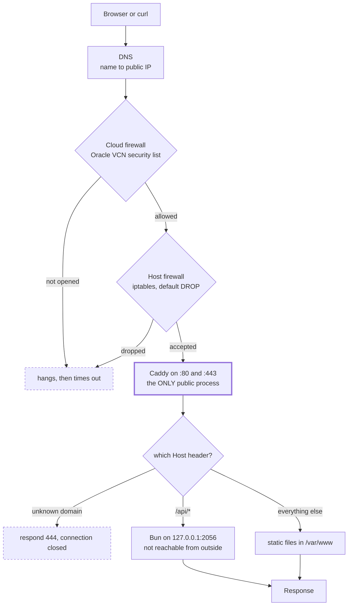

<!--
WHAT THIS FILE IS
Long-form newsletter post. ~2,200 words. Written for a Canva layout where the code
blocks are rendered as images.

FOR THE DESIGNER
- Every code block is marked `<!-- IMAGE n -->` with a caption line underneath it.
  There are 9. They are deliberately short so they read as graphics, not as walls of
  text. Render each one as its own image (Carbon, ray.so, or a Canva code block) and
  use the caption as the alt text or the figure label.
- IMAGE 6 (`namei -l`) is the hero. If one code image gets full width, make it that one.
- There is one mermaid diagram marked `<!-- DIAGRAM -->`. Render it and place it as a
  full-width break between sections. Suggested caption is underneath.
- Pull quotes are marked `<!-- PULL QUOTE -->`. There are 4. They sit outside the flow.
  The first one and the last one are the two worth making big.
- Links are inline markdown. Keep them live.
- Delete this comment block before publishing.
-->

**Title:** The backend never became public

**Subtitle:** I put my site on a free server. Here is the mental model I was missing, and every error that taught it to me.

---

Open a terminal, any terminal, and run this:

<!-- IMAGE 1 -->
```
curl raghav56.tech
```
*Caption: try this before you keep reading.*

You will get a business card. Coloured, boxed, laid out for a terminal. Open [the same
URL](https://raghav56.tech) in a browser and you get an ordinary website instead. Same
address, same server, two completely different things, decided by one header.

I think that is a fun trick. It is also the last 5% of this story. The other 95% was
finding out that a server does almost nothing you expect, and that every layer between
your code and a stranger's browser fails silently and separately.

I have now done this twice, on two different machines, seven months apart. The second time
took an afternoon. The first time took weeks, and this newsletter is the difference
between them.

---

## The free machine is real, and it is not a toy

[Oracle Cloud's Always Free tier](https://www.oracle.com/cloud/free/) is not a trial. It
does not expire after twelve months. The ARM allocation is **4 CPUs and 24 GB of RAM**,
permanently, for nothing.

The box everyone recommends for six dollars a month is 1 CPU and 1 GB. Here is mine, right
now:

<!-- IMAGE 2 -->
```
$ nproc
4

$ free -h
               total        used        free   available
Mem:            23Gi       3.1Gi       686Mi        20Gi

$ uptime -p
up 12 weeks, 6 days
```
*Caption: four cores, 23 GB, three months of uptime, zero rupees.*

That machine serves a website, a Postgres database, a log aggregator, a metrics dashboard,
and two other people's college projects, and it is using 3 GB.

Two things nobody warns you about.

**You will see "Out of capacity for shape VM.Standard.A1.Flex".** Probably several times.
That is not a rejection, it is a queue. Retry at a different hour, pick a less obvious home
region when you sign up (you cannot change it later), or create a smaller instance and
resize it afterwards, which often works when creating at full size does not.

**Your machine is ARM.** Download the `arm64` build of things, not `amd64`. An x86 binary
on ARM gives you `Exec format error` and no other hint. It has genuinely never been a
problem for me, but it is worth knowing before you spend an hour confused.

---

## The mental model I was missing

Here is the thing I wish someone had drawn for me on day one. Not the tools. The journey.

<!-- DIAGRAM -->

*Caption: three independent gatekeepers before your code ever runs. Any one can say no, and none of them will tell you.*

Read that diagram once more and notice where your application actually sits. It is at the
bottom, on `127.0.0.1`, which means it cannot receive traffic from the internet at all. One
process is exposed, and it is not yours.

<!-- PULL QUOTE -->
> Your app is not on the internet. Something in front of it is.

---

## It runs. You close the laptop. It stops.

Your first deploy is you, typing `bun run server.js` into an SSH session. It works. You are
delighted. Then your wifi drops and the site dies with it, because your program was a child
of your login session and the session ended.

The usual first fixes are `nohup` and `tmux`. Both survive logout. Neither restarts your app
when it crashes, neither survives a reboot, and neither leaves any trace that the service
exists for anyone else on the machine to find.

The real answer was already installed. [systemd](https://www.freedesktop.org/software/systemd/man/systemd.service.html)
started every other service on your box, and it will happily start yours.

Here is roughly my first attempt, from that earlier server:

<!-- IMAGE 3 -->
```ini
[Service]
User=ubuntu
WorkingDirectory=~/raghav/Agent_kdg
ExecStart=uv run main.py
StandardOutput=append:logs/server.log
```
*Caption: four separate mistakes in four lines. Can you spot them?*

systemd told me, in language that is genuinely helpful once you can read it:

<!-- IMAGE 4 -->
```
Loaded: bad-setting
Main PID: 3476 (code=exited, status=203/EXEC)

WorkingDirectory= path is not absolute: ~/raghav/Agent_kdg
```
*Caption: three error strings worth memorising. You will meet all of them.*

**`path is not absolute: ~/...`** means systemd does not expand `~`. Tilde expansion is a
*shell* feature, and there is no shell here. The same applies to `$HOME`, globs, and `&&`.
Write every path out in full.

**`status=203/EXEC`** means systemd could not execute the thing you named. Wrong path,
missing file, or missing execute bit.

**`Loaded: bad-setting`** means the unit file itself is invalid, so nothing ever ran. That
is different from `Loaded: loaded` plus `Active: failed`, which means your program started
and then exited. One is your config, the other is your code.

And a quieter fourth: relative paths in `StandardOutput=append:logs/server.log` resolve
against `/`, not against your working directory.

Then the one that catches everybody exactly once. Both commands succeed, and nothing runs:

<!-- IMAGE 5 -->
```
$ sudo systemctl start agent
$ pgrep -f "uv run main.py"
$            # nothing. no error. no output.
```
*Caption: silence is the worst error message.*

`ExecStart` said `uv`, and systemd has no idea where that is. **systemd does not read your
`.bashrc`.** Neither does cron. Neither does `ssh host "command"`, which is how your CI will
deploy. Every tool you installed into your home directory is invisible to all three.

Run `which uv`, paste the full path, and it will run for months without being touched.
Mine did.

---

## Nothing can reach it

This is the failure that wastes days, and the diagram above is the whole answer. Three
systems have to agree, and they fail independently.

**Layer one is what address your app bound to.** A socket binds to an address *and* a port.
`127.0.0.1` means the kernel will only ever deliver packets that came from this same
machine. Not "is blocked from the internet". Cannot receive from it. `0.0.0.0` means every
interface, including the public one.

The habit to build is reading the address column, never the port:

<!-- IMAGE 6 -->
```
$ ss -tlnp
LISTEN  127.0.0.1:2056   bun     ← unreachable from outside
LISTEN          *:443    caddy   ← the only public door
```
*Caption: same machine, same kind of app, completely different exposure.*

In Express, `app.listen(PORT)` with no host argument binds `0.0.0.0`. Every tutorial writes
it that way, and it is the most common accidental exposure in student projects. Pass
`app.listen(PORT, "127.0.0.1")`.

**Layer two is the host firewall.** Every guide on the internet tells you `sudo ufw allow 80`.
On the Oracle image `ufw` is not installed and that command does not exist. Rules are raw
iptables with a default DROP policy, saved with `netfilter-persistent`.

While you are in there: **never run `iptables -F` on Oracle Cloud.** There is a chain in the
default rules carrying cloud metadata, DHCP, NTP, and the iSCSI mount for your boot volume.
Flushing it can cost you the root disk. It is the most expensive single command available
to you on that platform.

**Layer three is the cloud firewall**, and it is invisible from inside the machine. Oracle's
security list opens port 22 and nothing else. You can have every single thing on the box
correct and still get nothing, because the packet never arrived.

The trick that identifies the layer in one second is the *shape* of the failure, not the
message:

- Hangs, then times out → a firewall dropped it silently. Layer two or three.
- Instant `connection refused` → it reached your machine and nothing was listening. Layer one.
- Connects, then nothing → your app is broken. This was never a network problem.

One honest correction to myself. Early on, with no reverse proxy, `0.0.0.0` is the *correct*
answer and `127.0.0.1` will drive you mad, because nothing outside can reach it, including
you. Once a proxy exists, everything moves back to loopback. Same question, opposite right
answers, depending on what else is running. Check which world a tutorial was written for.

---

## The receptionist

Eventually a friend wants to host their project on your box too, and there is exactly one
port 443.

The way I ended up explaining this out loud to a batchmate is the version that finally
stuck for both of us. **The proxy is a receptionist.** The public IP is the building
entrance. The receptionist sits at the front desk. Your backends are departments upstairs.
Nobody walks in off the street and straight into a department.

Which answers the question that confused me for months. If my backend is on `127.0.0.1`,
how is anybody on the internet using it?

They are not. They are talking to the receptionist.

<!-- PULL QUOTE -->
> The backend never became public. That was the whole point.

I started on [nginx](https://nginx.org/en/docs/) and moved to [Caddy](https://caddyserver.com/docs/).
Learn nginx anyway, because it is on every server you will ever inherit. But know the
trade. In nginx these four lines are mandatory and nothing warns you:

<!-- IMAGE 7 -->
```nginx
proxy_set_header Host              $host;
proxy_set_header X-Real-IP         $remote_addr;
proxy_set_header X-Forwarded-For   $proxy_add_x_forwarded_for;
proxy_set_header X-Forwarded-Proto $scheme;
```
*Caption: forget the last line and your HTTPS site starts emitting http:// links.*

Here is the entire Caddy equivalent, and this is a real, complete, unedited file from my
server:

<!-- IMAGE 8 -->
```caddyfile
api.example.com {
    reverse_proxy localhost:5001
}
```
*Caption: this obtains a certificate, renews it forever, redirects HTTP to HTTPS, sets all four headers, and turns on HTTP/2 and HTTP/3.*

---

## The 403 that redesigned my server

My first attempt at serving files pointed the web server straight at my project folder.
Every request came back `403`, with a `content-length` of zero. No message. TLS fine.
Routing fine. The file existed, and `ls -l` said it was world readable.

This is the command that solves it, and it is the most useful thing in this entire
newsletter:

<!-- IMAGE 9 -->
```
$ namei -l /home/ubuntu/raghav/site/static/index.txt
drwxr-xr-x root   root   /
drwxr-xr-x root   root   home
drwxr-x--- ubuntu ubuntu ubuntu
drwx------ ubuntu ubuntu raghav          ← 700. there it is.
-rw-rw-r-- ubuntu ubuntu index.txt       ← world readable, and irrelevant
```
*Caption: `namei -l` walks every directory in a path. `ls -l` on the file lies to you.*

**Directory permissions compose.** To read a file you need traverse permission on every
single directory above it. My file being readable meant nothing, because a folder two
levels up was `700`.

The obvious fix is `chmod 755` on your home directory. Do not. That makes every project,
key, and dotfile you own readable by every other account on the machine, in order to fix
one file.

I refused, and that refusal is where my actual architecture came from. The source tree
stays at `700` and the web server genuinely *cannot* read it. The build compiles into a
separate folder and copies the output into `/var/www`, which the web server can read and
which contains nothing but HTML, CSS and images. If a file server ever has a path traversal
bug, it leaks pages that were already public, instead of my `.env`, my SSH keys, and my
`.git` directory.

<!-- PULL QUOTE -->
> The 403 was not a problem to work around. It was the filesystem telling me my design was wrong.

---

## Certificates are easy. Renewals are where you fail.

[Let's Encrypt](https://letsencrypt.org/) gives you a certificate in one command. Keeping
one is the hard part, and a certificate that stops renewing takes your site down ninety
days after you last thought about it.

On my box, as I write this, **both certificates have broken renewal**, for two different
reasons. That is exactly why they are worth showing you.

One is configured with a *manual* authenticator, which means the renewal process stops and
waits for a human to add a DNS record. On a server, at 3am, nobody answers.

The other renews through the nginx plugin. I moved to Caddy months ago and nginx is
stopped. **Renewal configs do not follow you when you change web servers.** They keep
pointing at the old one and fail quietly.

There is a third trap waiting even when renewal works: the renewal hooks directory is empty
by default, so nothing reloads your web server afterwards. The certificate on disk is fresh
and the one being served is expired, and every check you run against the file says
everything is fine.

Two things to do the day you set up TLS. Run `sudo certbot renew --dry-run`, which surfaces
all three of those immediately. And write the reload hook. Or, if you do not specifically
need a wildcard certificate, use Caddy and skip this entire section of your life.

---

## Check the advice. Including mine.

While debugging that first server I was told, confidently, that `nohup` forks a child
process and that this explained a PID mismatch I was chasing. It sounded reasonable. It is
wrong. `nohup` ignores the hangup signal, redirects output, and then replaces itself with
your command in the same process. Same PID throughout. You can verify it in ten seconds
with `nohup sleep 40 &` and `ps`.

The actual bug, which neither the question nor the answer noticed, was sitting in the
timestamps I had pasted: the process I was staring at had started an hour earlier on a
different terminal. It was a leftover still holding the port, and the copy I had just
launched had died on `EADDRINUSE`. Two instances. The whole PID discussion was chasing a
symptom.

And a fresh one, from an hour ago, while writing this. I made a backup of my Caddy config
as `raghav56.tech.caddy.bak` and left it *inside* the `sites-enabled/` folder. That folder
is imported with a `*` glob, so Caddy loaded the backup as a second site and died on a
duplicate definition. Nothing broke, because the deploy runs `caddy validate` before
`caddy reload`, and validate refused. The live site never noticed.

That habit is worth more than any config in this post:

<!-- PULL QUOTE -->
> Validate before you reload. It turns a typo into a failed deploy instead of an outage.

---

## Where to start

If you want to try this, the order that works is: get the machine, get *something*
responding on a port, then put a proxy in front, then add the domain, then TLS, then
automate the deploy. Each step exists because the previous one broke.

- [Oracle Cloud Always Free](https://www.oracle.com/cloud/free/) for the server
- [GitHub Student Developer Pack](https://education.github.com/pack) for a free `.tech` domain
- [Caddy](https://caddyserver.com/docs/quick-starts/reverse-proxy) for the proxy and automatic HTTPS
- [Tailscale](https://tailscale.com/) so your dashboards are on a private network instead of a public subdomain
- `man ss`, `man namei`, `man systemd.service`. Genuinely.

The full sixteen-part version of this, with every config and every quirk I collected, is at
[raghav56.tech/blog](https://raghav56.tech/blog).

And if you only take one thing: your app is not on the internet. Something in front of it
is. Once that clicks, the rest is just layers.
